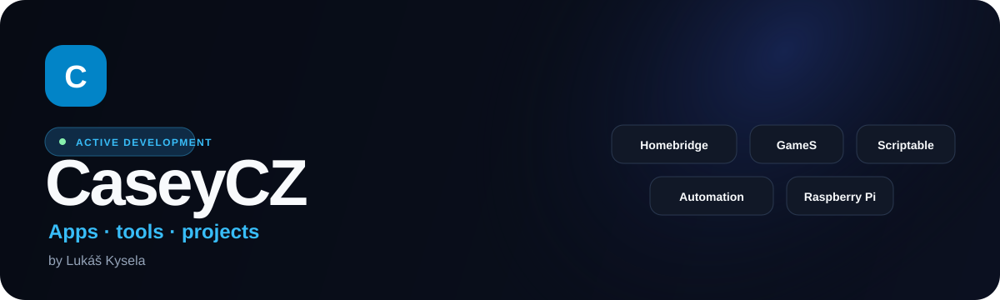

  

  
  

  Stavím praktické nástroje, které bych sám chtěl používat — od správy Homebridge přes herní kalendář až po iPhone widgety, cestovní nástroje a Stremio doplňky.

  

## Aktuální projekty

<table>
  <thead><tr><th>Projekt</th><th>Verze</th><th>Info</th><th>Odkazy</th></tr></thead>
  <tbody>
    <tr><td><strong>Homebridge Manager</strong></td><td><code>v0.6.4</code></td><td>Mobilní správa Homebridge navržená pro iPhone a PWA.</td><td></td></tr>
    <tr><td><strong>GameS Calendar</strong></td><td><code>v3.1.5</code></td><td>Herní kalendář a vyhledávač připravovaných i vydaných her.</td><td> </td></tr>
    <tr><td><strong>Scriptable Apps</strong></td><td><code>více aplikací</code></td><td>Widgety a nástroje pro iPhone včetně Sports Info a LockScreen Generator.</td><td> </td></tr>
    <tr><td><strong>Travel Checklist</strong></td><td><code>web</code></td><td>Pomocník na cesty se seznamy, šablonami, tiskem a sdílením.</td><td> </td></tr>
    <tr><td><strong>Stremio Sosáč</strong></td><td><code>v0.4.5</code></td><td>Katalogy, metadata a video streamy pro Stremio.</td><td> </td></tr>
    <tr><td><strong>Sosáč Subtitles</strong></td><td><code>v2.9.8</code></td><td>Samostatný Stremio addon pro titulky.</td><td> </td></tr>
  </tbody>
</table>

## O mně

Jsem **Lukáš Kysela / CaseyCZ**. Profesně se dlouhodobě pohybuji v plánování výroby a SAPu. Ve vlastních projektech se zaměřuji hlavně na praktické aplikace, automatizaci a nástroje, které řeší konkrétní potřebu.

## Aktivita na GitHubu

  

## Podpora

  

   
  Naskenuj QR kód nebo klikni na tlačítko.

## Sociální sítě

  
  
  

