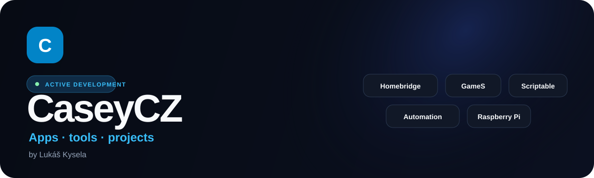

  

  
  

  Stavím praktické aplikace a nástroje, které bych sám chtěl používat — pro <strong>iPhone, Apple TV, Homebridge, Raspberry Pi, Windows, web a Stremio</strong>.

  
  
  
  

  

## Aktuální projekty

<table>
  <thead><tr><th>Projekt</th><th>Stav / verze</th><th>Info</th><th>Odkazy</th></tr></thead>
  <tbody>
    <tr>
      <td><strong>HB Control</strong></td>
      <td></td>
      <td>Nativní iOS/iPadOS aplikace pro správu Homebridge — Dashboard, pluginy, aktualizace, Child Bridges, logy, zálohy, konfigurace, diagnostika a Apple Home pairing.</td>
      <td></td>
    </tr>
    <tr>
      <td><strong>PiTV</strong></td>
      <td> </td>
      <td>TV prostředí pro Raspberry Pi nad Ubuntu Serverem s HDMI-CEC, PiTV Store, Server Store, Waydroidem a 24/7 serverovými službami.</td>
      <td></td>
    </tr>
    <tr>
      <td><strong>TubeTV</strong></td>
      <td><code>aktivní vývoj</code></td>
      <td>Nativní YouTube klient pro Apple TV / tvOS s TV-first rozhraním, účtem, playlisty, titulky, překladem, volbou kvality, 4K/HDR a ovládáním Apple TV Remote.</td>
      <td></td>
    </tr>
    <tr>
      <td><strong>CorePilot</strong></td>
      <td><code>aktivní vývoj</code></td>
      <td>Hardware-aware nástroj pro Windows, který ověří cílový počítač, připraví instalační médium a bezpečně zapisuje Windows, Linux nebo podporované macOS/OpenCore konfigurace.</td>
      <td> </td>
    </tr>
    <tr>
      <td><strong>GameS Calendar</strong></td>
      <td></td>
      <td>Herní kalendář a vyhledávač s IGDB, platformami, oblíbenými hrami, odpočtem, detaily a přidáním vydání do kalendáře.</td>
      <td> </td>
    </tr>
    <tr>
      <td><strong>iOS Hub</strong></td>
      <td><code>web</code></td>
      <td>Živý katalog AltStore / SideStore / LiveContainer zdrojů, Source Builder, Help Center a lokální DEB → IPA převodník.</td>
      <td> </td>
    </tr>
    <tr>
      <td><strong>Scriptable Apps</strong></td>
      <td> </td>
      <td>Widgety a nástroje pro iPhone — LockScreen Generator, Sports Info a připravovaný Sports Live.</td>
      <td> </td>
    </tr>
    <tr>
      <td><strong>iOS IPA Builder</strong></td>
      <td><code>GitHub Actions</code></td>
      <td>Builder pro čisté unsigned IPA i podepsané App Store/TestFlight IPA bez lokálního Macu. Podporuje Native Xcode, Capacitor, Flutter a React Native.</td>
      <td> </td>
    </tr>
    <tr>
      <td><strong>Stremio Sosáč</strong></td>
      <td></td>
      <td>Stremio addon s katalogy, metadata a video streamy; titulky používají kompatibilní Hybrid režim a samostatný Direct test.</td>
      <td> </td>
    </tr>
    <tr>
      <td><strong>Sosáč Subtitles</strong></td>
      <td></td>
      <td>Samostatný Stremio addon pro titulky ze Sosáč a Streamuj.tv, včetně Apple-kompatibilního fallbacku.</td>
      <td> </td>
    </tr>
    <tr>
      <td><strong>Travel Checklist</strong></td>
      <td><code>web</code></td>
      <td>Pomocník na cesty se seznamy, šablonami, tiskem a sdílením.</td>
      <td> </td>
    </tr>
  </tbody>
</table>

## Zaměření

- 🍎 **iOS / iPadOS / tvOS** — Swift, SwiftUI, nativní Apple aplikace
- 🏠 **Homebridge & smart home** — správa serveru, pluginy, automatizace a diagnostika
- 📺 **Raspberry Pi & Linux** — TV prostředí, servery, Wayland, Waydroid, HDMI-CEC
- 🪟 **Windows & instalační nástroje** — .NET, PowerShell, bezpečné USB workflow
- ⚙️ **GitHub Actions** — automatické buildy, release workflow, kontroly a deployment
- 🌐 **Web & Node.js** — katalogy, API, Stremio addony a praktické webové nástroje

## O mně

Jsem **CaseyCZ**. Profesně se dlouhodobě pohybuji v plánování výroby a SAPu. Ve vlastních projektech se zaměřuji hlavně na praktické aplikace, automatizaci a nástroje, které řeší konkrétní potřebu.

## Aktivita na GitHubu

  

## Podpora

  

   
  Naskenuj QR kód nebo klikni na tlačítko.

## Sociální sítě

  
  
  

